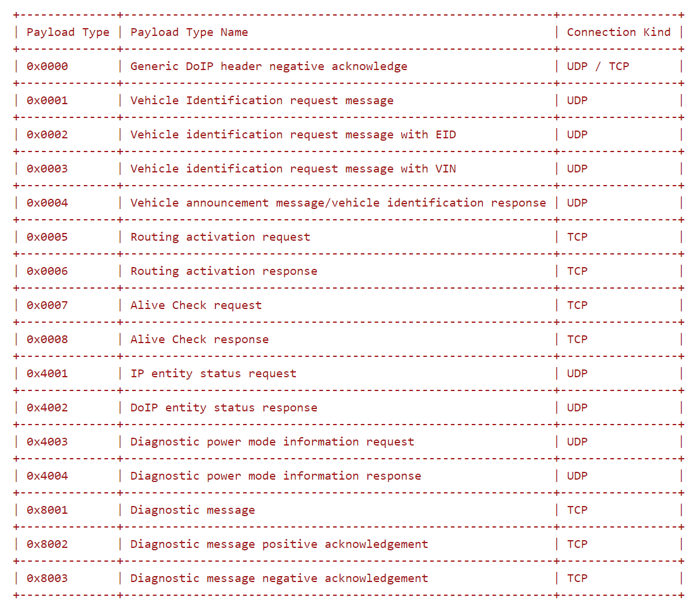
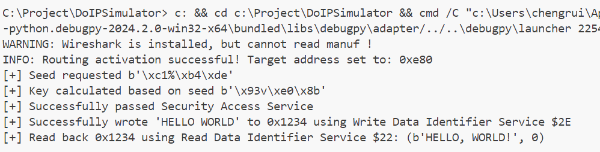
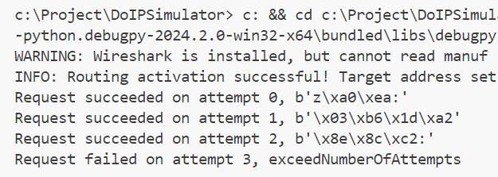

> The Diagnostic over Internet Protocol (DoIP) plays a crucial role in automotive security. In the absence of a complete vehicle, existing simulation solutions fall short. Hardware-dependent simulations using development boards or CANOE are not only costly but also involve complex setup processes that can be frustrating. Moreover, open-source software simulations often contain inaccuracies in emulating the UDS protocol via DoIP. To overcome these challenges, we have developed a highly adaptable DoIP protocol simulation framework in Python. This framework allows users to carry out a variety of tests, such as logic address scanning through routing activation, cracking security access service keys, and scanning the data items of $22 and $2E services. It's also designed for easy further development and enhancement of simulation functionalities. The code is available as an open-source resource on GitHub.

## DoIP Protocol
DoIP stands for "Diagnostic Communication over Internet Protocol," a sophisticated vehicle diagnosis protocol that operates over automotive Ethernet networks. Within a DoIP network, the system fundamentally consists of two entities: the DoIP gateway and DoIP nodes. Each DoIP node corresponds to a specific vehicle component and is tagged with a unique Logical Address. Most DoIP packets feature source_address and target_address fields; these denote the source and destination Logical Addresses for each packet. A key role of the DoIP gateway is to accurately forward packets to their intended DoIP node, directed by the target_address information.

The foundational structure of a DoIP message follows this layout, wherein the protocol version is generally 2 (with rarer instances of version 3). To ensure correctness, the inverse of the protocol version combined with the protocol version equals 0xFF. The Payload Type provides a classification of the payload's variety:

```
|Protocol Version (1 Byte)|Inverse Protocol Version (1 Byte)|Payload Type (2 Bytes)|Payload Length (4 Bytes)|DoIP Payload (Variable Bytes)|
```

With respect to Payload types supported by DoIP v2, a few notable ones include 0x0005 and 0x0006, essential for 'routing activation,' which is a precursor for executing diagnostic functions. Moreover, Payload type 0x8001 is instrumental for conducting UDS diagnostics within the DoIP. It's critical to recognize the nuanced distinction between Payload types 0x8002 and 0x8003, which could be misleading. Though an ECU's diagnostic response is conveyed via the 0x8001 Payload, Payloads 0x8002 and 0x8003 serve to affirm that the diagnostic messages have been rightly received by the ECU or indicate receipt but with interpretative issues.



## Usage
### Start Simulation
The provided Python code outlines a straightforward simulation setup for a DoIP (Diagnostic communication over Internet Protocol) network. Here's a breakdown of the code and the network it simulates:

1. A DoIP gateway is created to run at the IP address `0.0.0.0` on port `13400`.
2. The network comprises two simulated DoIP nodes:
   - The first node has a logical address of `0x0e80` and uses a pincode `b"2345"` for its security access service.
   - The second node has a logical address of `0x1010` and uses a pincode `b"4321"` for the same purpose.
3. Both nodes rely on the default key calculation method, `DoIPNode.calc_key`, for generating the security access keys, as no specific key algorithm is explicitly stated in the code.

```python
import doipsimu.doipserver as doipserver
from doipsimu.doipclient import DoIPSocket, UdsOverDoIP

# Create the DoIP gateway
gw = doipserver.DoIPGateway(protocol_version=2)

# Create and add ECU nodes to the DoIP gateway, set their logical addresses and PINCODE
ecu1 = doipserver.DoIPNode(logical_address=0x0e80, pincode=b"2345")
ecu2 = doipserver.DoIPNode(logical_address=0x1010, pincode=b"4321")
gw.add_node(ecu1)
gw.add_node(ecu2)

# Start the simulation
gw.start()

# Stop the simulation
gw.stop()
```

### Performing Penetration Testing
#### $27 Service
Next, we can attempt to diagnose the DoIP network simulation using the UDS diagnostic module. The following code initially enters an extended session, then requests a random number seed from the security access service. Based on the random number seed, it computes the access key. After passing security access validation, it writes the string "HELLO WORLD" to the data element 0x1234 using the write data service. Subsequently, it employs the read data service to confirm whether the data element 0x1234 has been successfully written. The complete runtime output is shown below.

```python
# Begin diagnosing the simulated gateway
ds = DoIPSocket(source_address=0x1010, target_address=0x0e80)
uds = UdsOverDoIP(ds)

# Enter extended diagnostic session
uds.open_extended_session()

# Request seed
o = uds.request_seed()
while o is None:
    o = uds.request_seed()
seed, code = o
print("[+] Seed requested", seed)
key = doipserver.DoIPNode.calc_key(seed, b"2345")
print("[+] Key calculated based on seed", key)
if uds.send_key(key=key) == 0:
    print("[+] Successfully passed Security Access Service")
    if uds.write_did(0x1234, b"HELLO, WORLD!") == 0:
        print("[+] Successfully wrote 'HELLO WORLD' to 0x1234 using Write Data Identifier Service $2E")
        print("[+] Read back 0x1234 using Read Data Identifier Service $22:", uds.read_did(0x1234))
    else:
        print("[+] Write Data Identifier Service $2E failed")
else:
    print("[-] Failed to pass Security Access Service")

# Exit extended diagnostic session
uds.exit_extended_session()
```

The output is shown in the following figure.



#### $22 Service
# Enumerate the DIDs that can be read by Service $22
```python
for did in range(0, 0xFFFF):
    o = uds.read_did(did)
    if o is None:
        continue

    data, code = o
    if code == 0:
        print("[+] Successfully read 0x%04x %s" % (did, str(data)))

Output:
INFO: Routing activation successful! Target address set to: 0xe80
[+] Successfully read 0x0001 b'Hu.Jiacheng'
[+] Successfully read 0x0002 b'Wang.Zhiyi'
[+] Successfully read 0x0003 b'Zhang.Chengao'
[+] Successfully read 0x0004 b'Cheng.Rui'
[+] Successfully read 0x0005 b'Lian.Xiaowu'
```

#### Logical Address Scan
```python
# Scan logical addresses
# Do not automatically activate routing
ds = DoIPSocket(source_address=0x1010, target_address=0x0e80, activate_routing=False)

for i in range(0, 0xFFFF):
    # Manually activate routing and check if activation is successful
    if ds.activate_routing(source_address=i, target_address=0):
        print("[+] Logical address 0x%04x discovered" % (i, ))

Output:
[+] Logical address 0x0e80 discovered
[+] Logical address 0x1010 discovered
```

### Enhancing Simulation Capabilities
#### Adding Request Count Limitation for Random Seed to the $27 Service

To implement a request count limitation for random seed requests in a secure access service simulation, you would follow these steps:

1. After creating a DoIP node, call the `add_uds_handler` method to introduce a custom handler that will process secure access services.
2. Each handler function follows a fixed prototype. The `pkt` parameter is the received DoIP data packet, which can be used to parse UDS diagnostic parameters among others. The `session` parameter is the context of the current UDS diagnostic session, which can record information such as whether security access has been passed and the current type of diagnostic session.
3. The handler function needs to return a DoIP data packet as a response to the UDS diagnostic request.

The prototype of handler is as follow.
```python
def my_securiy_access(pkt: doipserver.doip.DoIP, session: {}) -> doipserver.doip.DoIP:
    pass

ecu1.add_uds_handler(doipserver.uds.UDS_SA, my_securiy_access)
```

ou can modify the default implementation of the secure access service by adding a limitation on the number of requests within the code block generating the random seed, as shown below.
```python
...
if sat % 2 == 1:
    # If a seed request is made
    # Generate a random number seed
    session["seed"] = random.randbytes(session["seed_len"])

    # Increment the request count
    session["request_times"] = session.get("request_times", 0) + 1
    if session.get("request_times", 0) > 3:
        # If the request count exceeds 3 times, return UDS_NR, with the error code 0x36, indicating the maximum request limit has been exceeded
        resp = doip.DoIP(payload_type=0x8001, source_address=ta, target_address=sa) / uds.UDS() / uds.UDS_NR(
            requestServiceId=pkt[1].service,
            negativeResponseCode=0x36
        )

        return resp

    # Return the seed
    resp = doip.DoIP(payload_type=0x8001, source_address=ta, target_address=sa) / uds.UDS() / uds.UDS_SAPR(
        securityAccessType=pkt[2].securityAccessType,
        securitySeed=session["seed"]
    )
...
```

After modification, when a seed is requested for the fourth time, as shown below, it is found that on the fourth request, an error is returned indicating that the maximum request limit has been exceeded.

```python
# Begin attempt to diagnose the simulated gateway
ds = DoIPSocket(source_address=0x1010, target_address=0x0e80)
uds = UdsOverDoIP(ds)

uds.open_extended_session()

for i in range(4):
    seed, code = uds.request_seed()
    if code == 0:
        print("Request succeeded on attempt %d, %s" % (i, str(seed)))
    else:
        print("Request failed on attempt %d, %s" % (i, uds.negativeResponseCodes[code]))

uds.exit_extended_session()
```

