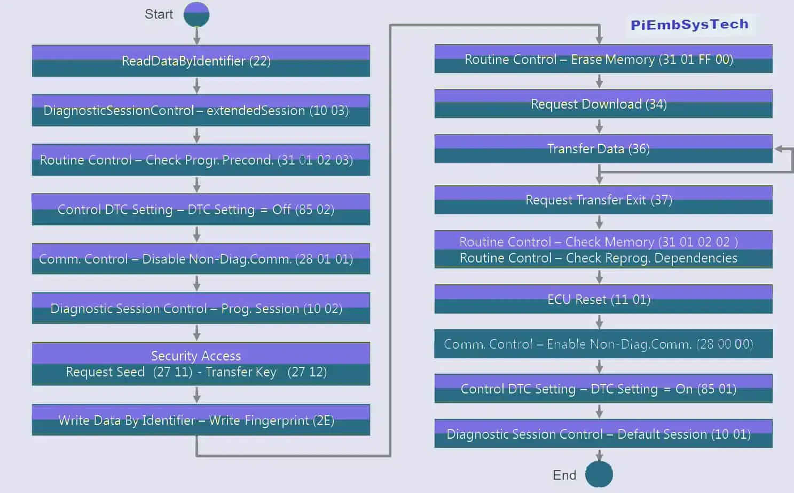
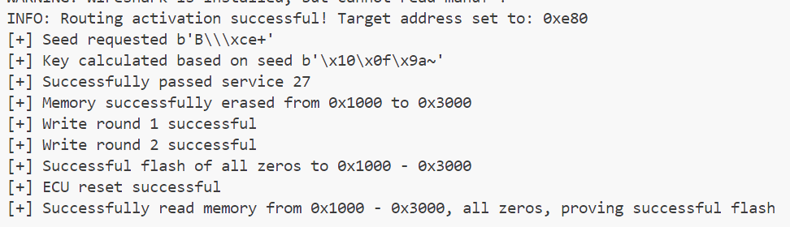

> The UDS diagnostic protocol provides RequestDownload and RequestUpload services for firmware flashing and retrieval from ECUs. This update allows users to attempt firmware flashing and retrieval.

## UDS Flashing Quick Guide

### Flashing
Reference [1] provides an easily understandable flashing flowchart; however, there are some issues with this flowchart. The steps highlighted in bold later in the text are where I believe there are problems with the diagram. The process in the diagram can be divided into the following three steps:

- **Pre-programming Phase**
As the name suggests, this step has not yet entered the flashing process; it is simply preparing for flashing, with details described as follows:
0. I believe that service #22 in the diagram should be meaningless
1. Enter the extended session 03 through service #10.
2. Perform Routing checks through service #31 to ensure the ECU is in a flashable state. Note that the Routing ID given in the diagram is 0x0203, which may vary with the vehicle. Reference [2] provides the naming convention for Routing IDs, where 0x0200 - 0xDFFF is designated by the device manufacturer.
3. Use services #85 and #28 to deactivate DTC and non-diagnostic messages, putting the entire CAN network in a quiet state, which should reduce CAN network communication load.
- **Main Programming Phase**
1. Switch to programming session 02 through service #10, as flashing can only be carried out in the programming session.
2. Pass security authentication through service #27.
3. Write some flashing records, such as information about the individual performing the flashing, using service #2E. This step is also custom-defined by the device manufacturer and is not universal.
4. Invoke the 0xFF00 Routing through service #31 to erase the FLASH content. Reference [2] indicates that the 0xFF00 Routing must be used for erasing FLASH content.
5. Request the ECU to download content to a specified location on FLASH via service #34.
6. Send the download content to the ECU via service #36.
7. Indicate the end of the transfer process and conclude the download with service #37.
8. Perform a memory check using the 0x0202 Routing through service #31. Reference [2] states that the 0x0202 Routing is designated by the device manufacturer, and this step is custom-defined and not universal.
9. Verify the integrity of the transferred content using the 0xFF01 Routing through service #31. Reference [2] indicates that the 0xFF01 Routing must be used for integrity checks.
10. Perform a hard reset of the ECU with service #11, and the ECU will execute the flashed firmware.
- **Post-programming Phase**
1. Re-enable the DTC and non-diagnostic messages that were deactivated in the pre-programming phase through services #28 and #85.
2. Enter the normal session 01 through service #10, concluding the flashing process.




Let's delve deeper into these steps and interpret the details of some services:
- **#31 RoutingControl Service**

The implementation details of the #31 service can be seen in reference [3]. I'll briefly introduce some key information. The #31 service is used to control/read the status of some Routings, which can be understood as a kind of remote procedure call protocol. The Tester (us) can use the #31 service to execute, stop some Routings, and read their status information. The data format for the #31 service is as follows: for executing/stopping Routing, the corresponding subFunction value is 01/02; for reading Routing status, the subFunction value is 03. The additional information is custom-defined by the device manufacturer and can be understood as parameters provided when calling Routing.
```
0x31 subFunction(Byte) Routing ID(Short) Additional Information(Custom Structure)
```
In the main programming phase, it is necessary to call Routing 0xFF00 to erase FLASH content, and the additional information for this Routing is generally two parameters, namely memory address and length. The structure of additional information is still custom-defined by the device manufacturer, and it might typically use this structure: Memory Address (32-bit integer) Length (32-bit integer). If the ECU has a 16-bit CPU, the type might change from a 32-bit integer to a 16-bit integer. In the main programming phase, it is also necessary to call Routing 0xFF01 to check the integrity of the transferred content, which has no additional information.

- **#34 RequestDownload Service**
The naming convention of the RequestDownload service is a bit odd. As I understand it, the Tester (us) requests that the ECU download a segment of content from the Tester to a specified memory location. The detailed description of this service can be seen in reference [4]. Here are some key information points. The data format for the #34 service is as follows: the dataFormatIdentifier field indicates the format of the data during transfer. A value of 0 means no compression or encryption; the lower 4 bits of this field indicate data encryption type, and the upper 4 bits indicate data compression type, with the meanings of the values being custom-defined by the device manufacturer. Therefore, this discussion only considers the case where this field is 0. The Address & Length FormatIdentifier field indicates the byte count of the memory address and length fields, with the lower 4 bits indicating the byte count of the memory address field, and the upper 4 bits indicating the length field's byte count. For example, if the value is 0x44, then both the memory address and length fields are 32-bit integers.
```
0x34 dataFormatIdentifier(Byte) Address & Length FormatIdentifier(Byte) Memory Address Length
```
The PositiveResponse for this service should also be noted. The definition in the scapy library for its response is as follows; the memorySizeLen field's naming is incorrect because its value actually equals the byte count of the maxNumberOfBlockLength field, which represents the maximum number of bytes that can be transferred in one go using the #36 TransferData service. When the data to be transferred exceeds this limit, the TransferData service must be called multiple times to transfer it in blocks.
```python
class UDS_RDPR(Packet):
    name = 'RequestDownloadPositiveResponse'
    fields_desc = [
        BitField('memorySizeLen', 0, 4),
        BitField('reserved', 0, 4),
        StrField('maxNumberOfBlockLength', b"", fmt="B"),
    ]
```

- **#36 TransferData Service**
The TransferData service is quite interesting. The #34 RequestDownload service transfers data from the Tester to the ECU, while the #35 RequestUpload service transfers data from the ECU to the Tester. The data transfer in both services is completed through the TransferData service, meaning that the TransferData service can perform bidirectional data transfer. In scapy, the data format definitions for the TransferData service and its corresponding PositiveResponse response are as follows. Note that they both contain the same fields; the blockSequenceCounter field is a block number that increments by one with each transfer, indicating the current block being transferred. Its value range is 00-FF, but its initial value starts from 1. The transferResponseParameterRecord field is the content of the block. Understanding this makes the implementation of bidirectional data transfer easy to grasp. When transferring data from the Tester to the ECU, the Tester sends a TransferData service packet to the ECU, where the transferRequestParameterRecord field is the content of this transfer; when transferring data from the ECU to the Tester, the Tester sends a TransferData service packet to the ECU with an empty transferRequestParameterRecord field, and the ECU sends a PositiveResponse to the Tester, where the transferResponseParameterRecord field is the content of this transfer.
```python
class UDS_TD(Packet):
    name = 'TransferData'
    fields_desc = [
        ByteField('blockSequenceCounter', 0),
        StrField('transferRequestParameterRecord', b"", fmt="B")
    ]

class UDS_TDPR(Packet):
    name = 'TransferDataPositiveResponse'
    fields_desc = [
        ByteField('blockSequenceCounter', 0),
        StrField('transferResponseParameterRecord', b"", fmt="B")
    ]
```

- **#35 RequestUpload Service**
As the name suggests, the Tester requests that the ECU upload content from a specific memory location to the Tester. The data structure of this service and the PositiveResponse are exactly the same as for the #34 service; only the direction of data transfer is different. The specific details can be found in the discussion of the #35 service.

- **#37 RequestTransferExit Service**
When the transfer is complete, this service is called to indicate the completion of the transfer.

### Retrival
Reading firmware and flashing firmware are fundamentally similar processes, with the exception that the #34 RequestDownload service is replaced by the #35 RequestUpload service, and the direction of data transfer changes when invoking the #36 TransferData service. I won't elaborate further on this as the principles are analogous.

## Details of Implementing UDS Flashing Service Simulation
Simulating the pre-programming and post-programming phases is not very meaningful; here, we only discuss the details of implementing the main programming phase simulation.

### Simulation of #34 RequestDownload Service
The detailed implementation of the #34 RequestDownload service simulation is as follows: First, check whether the current session is a programming session 02 and whether it has passed security access. Next, verify that the data format identifier indicates no encryption and no compression, and check whether the target address range for flashing is legal and whether the target address range has already been erased. If all these checks are passed, some information is recorded for use by the TransferData service.

```python
def request_download(self, pkt: doip.DoIP, session: Dict) -> doip.DoIP:
        if session.get("session_type", -1) != 2 or session.get("session_deadline", -1) <= time.time():
            # Flashing mode can only be executed in a 02 programming session, return 0x7F ServiceNotSupportedInActiveSession
            return self.mk_nr(pkt, 0x7F)

        # If security access has not been entered, or has been entered but the session has expired
        if session.get("sa_type", -1) == -1 or session.get("session_deadline", -1) < time.time():
            # Return 0x33 SecurityAccess Denied
            return self.mk_nr(pkt, 0x33)

        # Check if the data format is unencrypted and uncompressed
        if pkt[2].dataFormatIdentifier == 0:
            # Check if the length and address lengths are 4 bytes
            if pkt[2].memorySizeLen != 4 or pkt[2].memoryAddressLen != 4:
                # Return 0x22 ConditionNotCorrect
                return self.mk_nr(pkt, 0x22)
            
            # Target memory address and length to write
            addr = pkt[2].memoryAddress4
            size = pkt[2].memorySize4

            # Check if the target memory is within flash_mem range
            if addr + size >= len(self.flash_mem):
                # If not, return 0x31 RequestOutOfRange
                return self.mk_nr(pkt, 0x31)

            buf = self.flash_mem[addr : addr + size]
            # If all are \x00, it means it has been erased and can be written to
            if all(b == 0 for b in buf):
                # Record the address and length to download in the current session
                session["request_addr"] = addr
                session["request_cur"] = addr
                session["request_size"] = size
                session["request_seq"] = 0
                session["request"] = "download"
                # Maximum Block length
                return self.mk_pr(pkt, uds.UDS_RDPR(memorySizeLen=4) / int.to_bytes(self.flash_max_blocklen, byteorder="big", length=4))
            else:
                # Otherwise, it means that this memory segment has not been erased, return 0x70
                return self.mk_nr(pkt, 0x70)

        else:
            # Otherwise, return 0x22 ConditionNotCorrect
            return self.mk_nr(pkt, 0x22)
```
### Simulation of #36 TransferData Service
The simulation of the TransferData service needs to account for the bidirectional data transfer issue. Here we only show the implementation where the Tester transmits data to the ECU. First, as before, check if it is in a programming session and whether it has passed security access. Then read the data block sent by the Tester this time and write it into the current FLASH.
```python
def transfer_data(self, pkt: doip.DoIP, session: Dict) -> doip.DoIP:
    # If security access has not been entered, or has been entered but the session has expired
    if session.get("sa_type", -1) == -1 or session.get("session_deadline", -1) < time.time():
        # Return 0x33 SecurityAccess Denied
        return self.mk_nr(pkt, 0x33)
    
    if session.get("request", "") not in ["download", "upload"]:
        # If download or upload has not yet been requested, return 0x70 uploadDownloadNotAccepted
        return self.mk_nr(pkt, 0x70)
    
    block = pkt.transferRequestParameterRecord
    # Check if block length exceeds the maximum length
    if len(block) > self.flash_max_blocklen:
        # Return 0x31 Request out of range
        return self.mk_nr(pkt, 0x31)

    if session["request"] == "download":
        seq = session["request_seq"]
        seq += 1
        seq %= 0xFF
        # Check if block sequence number is continuous
        if seq == pkt[2].blockSequenceCounter:
            begin_addr = session["request_cur"]
            # Check if it exceeds write range
            if begin_addr + len(block) - session["request_addr"] > session["request_size"]:
                # Return 0x31 error
                return self.mk_nr(pkt, 0x31)
            
            # Write into memory
            self.flash_mem = self.flash_mem[:begin_addr] + block + self.flash_mem[begin_addr + len(block):]

            # Increment the current write pointer
            session["request_cur"] += len(block)

            # Update block sequence number
            session["request_seq"] = seq

            return self.mk_pr(pkt, uds.UDS_TDPR(blockSequenceCounter=seq))
        else:
            # Return 0x24 request sequence error
            return self.mk_nr(pkt, 0x24)
```

## Usage
The provided code is a demonstration of how to use a DoIP (Diagnostic over Internet Protocol) simulation with multiple ECU nodes. It outlines the process of establishing a diagnostic session, performing security access, erasing memory, flashing new firmware, resetting the ECU, and verifying the flash process. Here is an overview of the steps performed in the code:

1. Set up a DoIP gateway with protocol version 2 and add two ECU nodes to it with their respective logical addresses and PIN codes.
2. Start the gateway simulation to simulate the behavior of the ECUs.
Create a DoIP socket and a UDS over DoIP instance to communicate with the ECU.
3. Enter an extended diagnostic session (0x02) to perform programming-related tasks.
4. Request a seed for security access and calculate the key using the provided PIN code.
5. Send the security key to gain access to protected services.
6. Erase a memory range on the ECU to prepare for flashing new data.
7. Flash new data to the specified memory range using the reprogramming method, which involves sending data blocks and handling responses.
8. Reset the ECU and verify that the new data has been correctly flashed by reading back the memory content.
9. Exit the extended diagnostic session and stop the gateway simulation.

The my_callback function acts as a callback to be called after each data block transfer, indicating the progress and success or failure of the write operation.

```python
import doipsimu.doipserver as doipserver
from doipsimu.doipclient import DoIPSocket, UdsOverDoIP

def my_callback(code, seq, buf, cur, block_len):
    # Callback function for the flashing process, called after each data block is transferred
    # code: 0 for success, non-0 for a flashing failure; seq: block number; buf: data content of the current block; cur: target memory address for this write; block_len: maximum block length
    if code == 0:
        print(f"[+] Write round {seq} successful")
    else:
        print(f"[+] Write round {seq} failed")

# Create a DoIP gateway
gw = doipserver.DoIPGateway(protocol_version=2)

# Add ECU nodes to the DoIP gateway, set logical addresses and PINCODE
ecu1 = doipserver.DoIPNode(logical_address=0x0e80, pincode=b"2345")
ecu2 = doipserver.DoIPNode(logical_address=0x1010, pincode=b"4321")
gw.add_node(ecu1)
gw.add_node(ecu2)

# Start gateway simulation
gw.start()


# Begin attempting to diagnose the simulated gateway
ds = DoIPSocket(source_address=0x1010, target_address=0x0e80)
uds = UdsOverDoIP(ds)

# Enter extended session
uds.open_extended_session(diagnostic_session_type=2)

# Request seed
o = uds.request_seed()
while o is None:
    o = uds.request_seed()
seed, code = o
print("[+] Seed requested", seed)
key = doipserver.DoIPNode.calc_key(seed, b"2345")
print("[+] Key calculated based on seed", key)
if uds.send_key(key=key) == 0:
    print("[+] Successfully passed service 27")
    
    if (code := uds.erase_memory(0x1000, 0x3000)) == 0:
        print("[+] Memory successfully erased from 0x1000 to 0x3000")
    else:
        print("[+] Memory erase failed", uds.negativeResponseCodes[code])

    
    if (code := uds.reprogramming(0x1000, 0x3000, b"\x00" * 0x2000, my_callback)) == 0:
        print("[+] Successful flash of all zeros to 0x1000 - 0x3000")
    else:
        print("[+] Flash of all zeros to 0x1000 - 0x3000 failed")

    if (code := uds.reset(1)) == 0:
        print("[+] ECU reset successful")
    else:
        print("[+] ECU reset failed")

    ret = uds.get_flash(0x1000, 0x2000)
    if isinstance(ret, bytes) and all(b == 0 for b in ret):
        print("[+] Successfully read memory from 0x1000 - 0x3000, all zeros, proving successful flash")
    else:
        print("[-] Memory write failed or read failed")


else:
    print("[-] Failed to pass service 27")

# Exit extended session
uds.exit_extended_session()

# Stop gateway simulation
gw.stop()
```

